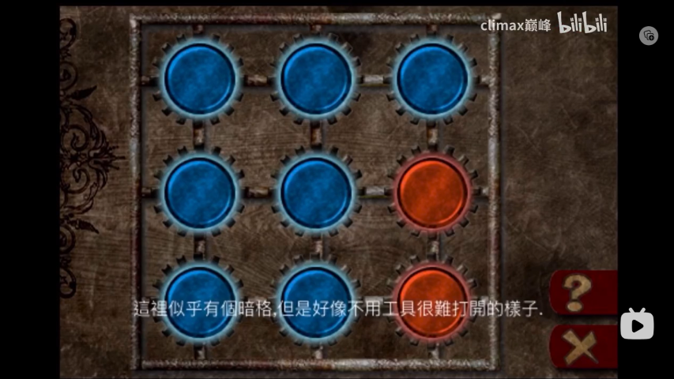
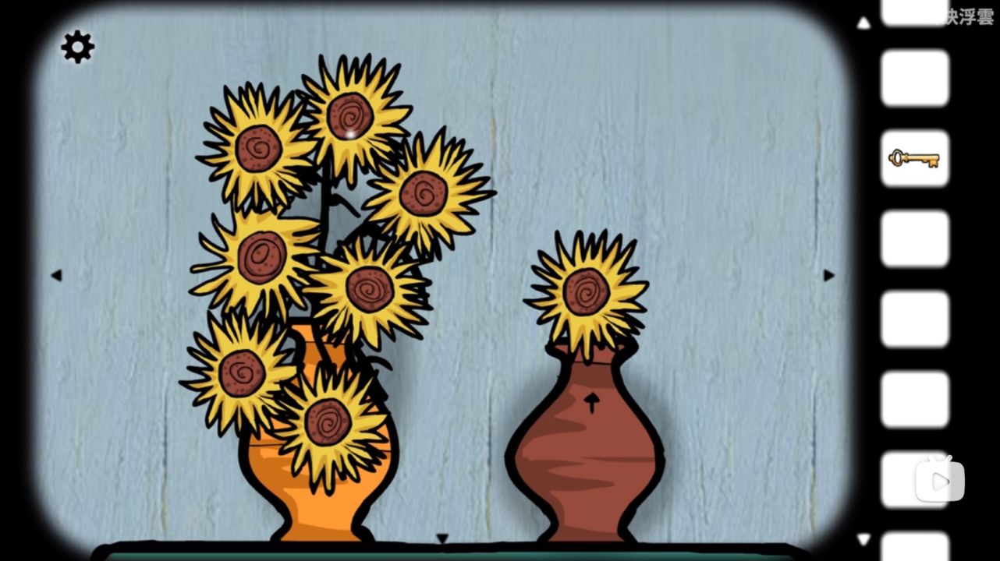
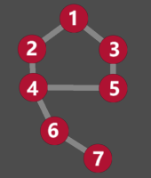
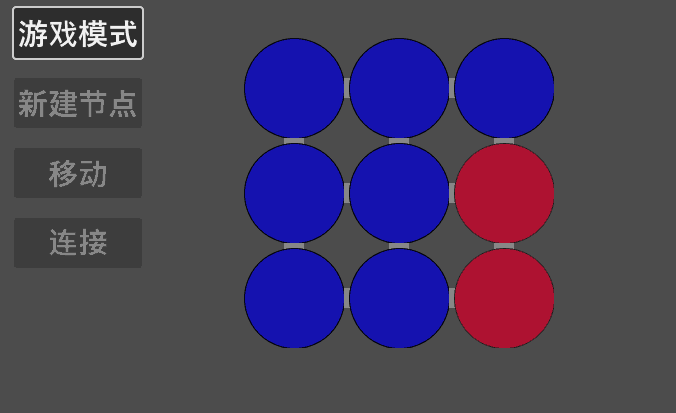
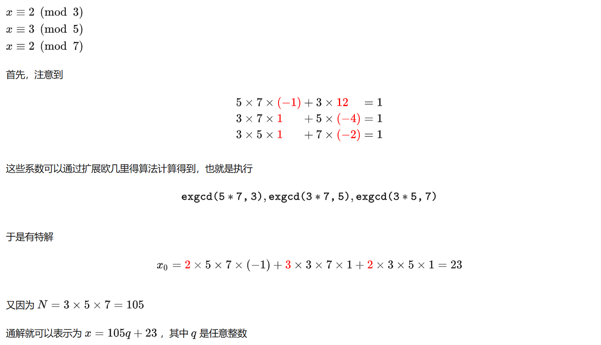
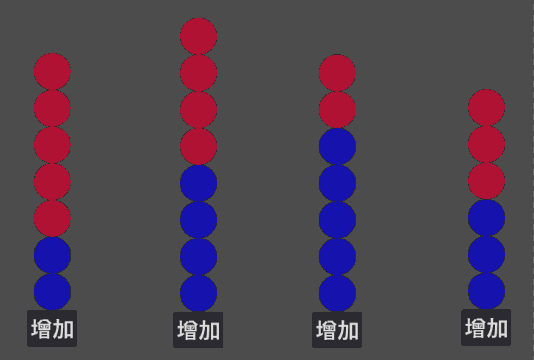
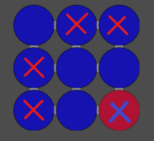
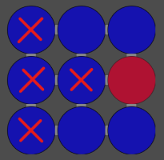
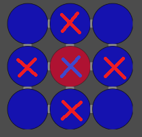
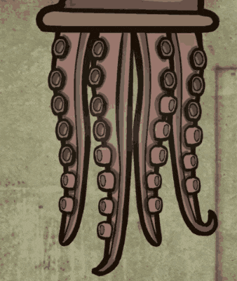

在游戏《逃离方块：洞穴》中，有一个这样的谜题，如下图[^1]所示：


谜题的规则如下：

1. 每点击一根触角，这根触角上的吸盘会增加两个，与之相邻的触角上的吸盘会增加一个（如对于图中从左数第 2 的触角，点击后，从左数各触角的吸盘数量为：3、6、6、3）
2. 如果触角上的吸盘已经满了，再增加就会全部清空，从零开始新增（如果点击图中左数第 2 个触角 3 下，则从左数各触角的吸盘数量为：5、2、1、3）
3. 全部的触角上的吸盘都满了，则算作谜题得解

由此，我们可以认为，触角 1 的吸盘数是模 7 的（即满 7 后再增加从 0 开始，只是游戏中用“7”的状态代替“0”的状态而已），最终目标是使其数值等于 7（即0）；同理，触角 2 就是模 8 的，以此类推。游戏的目标，是让所有触角的吸盘数，为各自模数集合中的 0。我们不妨设四个触角的点击数为 $a$， $b$， $c$， $d$，对于第一个触角，就有 $2a+b \equiv 5 \pmod 7$， $2a$ 表示点击自己对自己的吸盘数量增加值为 2， $b$ 表示点击第二个触角对第一个触角的增加值为 1，最终的目标是填充缺少的 5 个吸盘，同时考虑到周期的情况，要加上模 7。其他触角同理，那么，可以列出方程：

$$
\left\{\begin{matrix}\begin{align*}
2a+b \equiv 5 \pmod{7} \\
2b+a+c \equiv 4 \pmod{8} \\
2c+b+d \equiv 2 \pmod{7} \\
2d+c \equiv 3 \pmod{6}\end{align*}
\end{matrix}\right.
$$

显然，这个方程组过于复杂，难以求通解，即便是用计算机来计算也不算容易。游戏设计者当然是不会要求玩家去解这样一个方程，而是通过其他策略解决。对于如何求解这个问题，我们暂时搁置，而是先探讨另一个很相似的算法领域的问题——开关问题。

## 01 开关问题

开关问题的基本定义是：有 N 个相同的开关，每个开关都与某些开关有着联系，每当你打开或者关闭某个开关的时候，其他的与此开关相关联的开关也会相应地发生变化，即这些相联系的开关的状态如果原来为开就变为关，如果为关就变为开。你的目标是经过若干次开关操作后使得最后 N 个开关达到一个特定的状态。[^2]

这和上面的例子很像，只不过这里每个开关都只有“开”和“关”两个状态，是模 2 的。

这也有对应的游戏例子，如游戏《摩尔庄园》中的“警官任务”中就有类似的谜题[^3]：


每一个圈都和与它上下左右四个方向的圈相连，点击一个圈会改变这个圈的颜色（红色/绿色），同时也改变与它相连的圈的颜色。把所有的圈都变成绿色，视作谜题得解。这本质上也还是求解同余方程组的问题，只不过参数是 9 个，开关是模 2 的而已。

在游戏《被错过的天堂》中，也有一样的谜题[^4]：



此外，在《逃离方块：阿尔勒》中，也有一个相对更简单的“向日葵”开关解谜[^5]：



与前面的解谜类似，点击左侧的向日葵花圈会变大，并使得与之相邻的花圈也变大；使得左侧所有的向日葵都是“变大”状态，右侧的向日葵就会升到最高，并提供后续所需的钥匙。

向日葵花圈之间的连接关系类似下面的节点图：



以这个谜题为例，可以效仿最开始的例子，列出如下的同余方程组（设节点从上到下、从左到右依次为 a ~ g）：

$$
\left\{\begin{matrix}\begin{align*}
a+b+c \equiv 1 \pmod{2} \\
b+a+d \equiv 1 \pmod{2} \\
c+a+e \equiv 1 \pmod{2} \\
d+b+e+f \equiv 1 \pmod{2} \\
e+c+d \equiv 1 \pmod{2} \\
f+d+g \equiv 1 \pmod{2} \\
g+f \equiv 1 \pmod{2}\end{align*}
\end{matrix}\right.
$$

由于模均为 2，很容易想到另一种运算：异或。我们可以把上面的方程组看作是“每个方程的各变量必须有奇数个奇数”，如 $a+b+c \equiv 1 \pmod 2$ 就可以理解成 a，b，c 这三个数中，奇数应该有 1 个，或者 3 个都是，这就很容易用异或方程组来表示。

$$
\left\{\begin{matrix}\begin{align}
a \oplus b \oplus c = 1 \\
b \oplus c \oplus d = 1 \\
c \oplus a \oplus e = 1 \\
d \oplus b \oplus e \oplus f = 1 \\
e \oplus c \oplus d = 1 \\
f \oplus d \oplus g = 1 \\
g \oplus f = 1 \end{align}
\end{matrix}\right.
$$

<!-- astro 的公式序号始终无法右对齐，不折腾了 -->

经过很简单的推算就可以得到答案（带入验证过程略）：

$$
\begin{align*}
&\because \left\{\begin{matrix} 
  f \oplus d \oplus g = (g \oplus f) \oplus d &= 1 \space (6) \\
  g \oplus f &= 1 \space (7)
\end{matrix}\right. \\
&\therefore d = 0 \\
&\because b \oplus a \oplus d = 1 \space (2), e \oplus c \oplus d = 1 \space (5) \\
&\therefore a \oplus b = 1, c \oplus e = 1 \\
&\because \left\{\begin{matrix} 
  a \oplus b \oplus c = 1 \space (1) \\  
  a \oplus b = 1
\end{matrix}\right. \\
&\therefore c = 0, e = 1 \\
&\because c \oplus a \oplus e = 1 \space (3) \\
&\therefore a = 0, b = 1 \\
&\because d \oplus b \oplus e \oplus f = 1 \space (4) \\
&\therefore f = 1, g = 0
\end{align*}
$$

根据计算得到的结果，我们只需要依次点击第 2、第 5 和第 6 个节点，就可以解决该谜题。


当然，从程序的角度，我们更希望能够用某种通行的解法解题。对于线性方程组，我们可以将各参数和结果转换成增广矩阵，然后使用高斯消元法求解。异或方程组其实也一样，也可以转换成矩阵， 然后借用高斯消元的思想求解，且异或的计算要比线性方程更加简单。

我们可以先从基本的线性方程组求解入手，逐步过渡到异或方程组的求解。

## 02 从线性方程组到异或方程组

高斯消元法的原理和代码网络上已经有很多教程文章，这里不多赘述，给出一篇文章作为参考：[高斯消元法详解-CSDN博客](https://blog.csdn.net/lzyws739307453/article/details/89816311)（内含高斯消元的优化代码）

一言以蔽之，线性方程组的高斯消元法的步骤为：确定列主元 -> 消元 -> 重复直到消完 -> 回代

这里用 Python 重写上述博客的 C++ 代码，并修复部分问题：

```python
import numpy as np
import math

def select_col_e(a) -> None:
    tmp: float
    n: int = len(a)
    for i in range(n):
        r: int = i
        for j in range(i + 1, n):
            if math.fabs(a[j][i]) > math.fabs(a[r][i]):
                r = j
        if math.fabs(a[r][i]) < 1e-6:
            print("No Result.")
            exit()
        if r != i:
            for j in range(i, n + 1):
                a[i][j], a[r][j] = a[r][j], a[i][j]
        for j in range(i + 1, n):
            tmp = a[j][i] / a[i][i]
            for k in range(i, n + 1):
                a[j][k] -= a[i][k] * tmp

def gauss(a) -> None:
    select_col_e(a)
    n: int = len(a)
    for i in range(n - 1, -1, -1):
        for j in range(i + 1, n):
            a[i][n] -= a[i][j] * a[j][n]
            a[i][j] = 0.0
        a[i][n] /= a[i][i]
        a[i][i] = 1.0

matrix = np.array([
	[...] # 矩阵，要求n*(n+1)，数据为float型
])
gauss(matrix)
print(matrix)
```

由于异或方程组的值只有 0 和 1 两种可能，使用高斯消元的时候执行一步异或运算即可：

```python
import numpy as np

def select_col_e(a) -> None:
    n: int = len(a)
    for i in range(n):
        r: int = -1
        for j in range(i, n):
            if a[j][i] == 1:
                r = j
                break
        if r == -1:
            print("No Result.")
            exit()
        if r != i:
            for j in range(i, n + 1):
                a[i][j], a[r][j] = a[r][j], a[i][j]
        for j in range(i + 1, n):
            if a[j][i] == 0:
                continue
            for k in range(i, n + 1):
                a[j][k] ^= a[i][k]

def gauss(a: np.array) -> None:
    select_col_e(a)
    n: int = len(a)
    for i in range(n - 1, -1, -1):
        for j in range(i + 1, n):
            if a[i][j] != 0:
                a[i][n] ^= a[j][n]
                a[i][j] = 0

matrix = np.array([
    [...] # 矩阵，要求n*(n+1)，数据为int型且只取0或1
])
guass(matrix)
print(matrix)
```

我们可以将前面“向日葵”开关解谜的方程组转换为矩阵形式，并测试结果：

```python
matrix = np.array([
    [1, 1, 1, 0, 0, 0, 0, 1],
    [1, 1, 0, 1, 0, 0, 0, 1],
    [1, 0, 1, 0, 1, 0, 0, 1],
    [0, 1, 0, 1, 1, 1, 0, 1],
    [0, 0, 1, 1, 1, 0, 0, 1],
    [0, 0, 0, 1, 0, 1, 1, 1],
    [0, 0, 0, 0, 0, 1, 1, 1]
])
guass(matrix)
print(matrix)
# 输出结果如下：
# [[1 0 0 0 0 0 0 0]
#  [0 1 0 0 0 0 0 1]
#  [0 0 1 0 0 0 0 0]
#  [0 0 0 1 0 0 0 0]
#  [0 0 0 0 1 0 0 1]
#  [0 0 0 0 0 1 0 1]
#  [0 0 0 0 0 0 1 0]]
```

输出的矩阵中，最右侧的一列分别为：0，1，0，0，1，1，0，即第 2，5，6 节点为 1，其余均为 0，这与我们之前手算的结果是一致的。

再测试《被错过的天堂》中的例子：

```python
matrix = np.array([
    [1, 1, 0, 1, 0, 0, 0, 0, 0, 0],
    [1, 1, 1, 0, 1, 0, 0, 0, 0, 0],
    [0, 1, 1, 0, 0, 1, 0, 0, 0, 0],
    [1, 0, 0, 1, 1, 0, 1, 0, 0, 0],
    [0, 1, 0, 1, 1, 1, 0, 1, 0, 0],
    [0, 0, 1, 0, 1, 1, 0, 0, 1, 1],
    [0, 0, 0, 1, 0, 0, 1, 1, 0, 0],
    [0, 0, 0, 0, 1, 0, 1, 1, 1, 0],
    [0, 0, 0, 0, 0, 1, 0, 1, 1, 1]
])
gauss(matrix)
print(matrix)
# 输出结果如下：
# [[1 0 0 0 0 0 0 0 0 1]
#  [0 1 0 0 0 0 0 0 0 1]
#  [0 0 1 0 0 0 0 0 0 1]
#  [0 0 0 1 0 0 0 0 0 0]
#  [0 0 0 0 1 0 0 0 0 1]
#  [0 0 0 0 0 1 0 0 0 0]
#  [0 0 0 0 0 0 1 0 0 0]
#  [0 0 0 0 0 0 0 1 0 0]
#  [0 0 0 0 0 0 0 0 1 1]]
```

即只需要点击（从上往下、从左往右数）第 1，2，3，5，9 个节点即可完成解谜。

这里使用 Godot 简单写了一个程序用于验证，可以看到，结果是正确的。



## 03 多元线性同余方程组

现在回到最开始的“章鱼”谜题，我们可以沿用这种高斯消元的方法去解决这样一个同余方程组吗？似乎不能。虽然异或方程组也可以视作是模 2 的线性方程组，但在异或方程组中，每一个方程的模都是一样的；也就是说，只能确保模相同的同余方程组可以用类似的方法解决。

这部分涉及到复杂的数论问题，超出了本人的知识范畴和研究能力。但就网络上大多数关于数论和线性同余方程的问题，也多集中于一元线性同余方程（组），以及模相同的多元线性同余方程组，鲜有对模不同的同余方程组的讨论。

对于一元线性同余方程组，通常可以使用中国剩余定理及更一般的数论公式求解[^6]：



对于同模的多元线性同余方程组，因为处于同一数集，也可以用矩阵消元的方式求解。对于形如

$$
\left\{\begin{matrix} 
  a_1x+b_1y \equiv c_1 \pmod{m}  \\  
  a_2x+b_2y \equiv c_2 \pmod{m}
\end{matrix}\right.
$$

的方程组，可以先通过矩阵消元（消元时考虑数域即可）化简成

$$
\left\{\begin{matrix} 
  k_1x \equiv n_1 \pmod{m}  \\  
  k_2x \equiv n_2 \pmod{m}
\end{matrix}\right.
$$

的形式，然后再对每个一元同余方程求解[^7]。或者用不定参数表示模数，改写方程观察求解[^8]。

然而，对于不同模的情况，似乎没法总结出一套系统的方案解决。苦于能力有限，为了快速的得到答案，这里放弃寻找通解，直接编写程序暴力求解最小可行值：

```python
import numpy as np

def loop_solve() -> None:
    max_n: int = 1
    a = np.array([0, 0, 0, 0])
    while True:
        for i in range(4):
            a[i] = max_n
            for j in range(max_n + 1):
                a[(i + 1) % 4] = j
                for k in range(max_n + 1):
                    a[(i + 2) % 4] = k
                    for m in range(max_n + 1):
                        a[(i + 3) % 4] = m
                        if (2 * a[0] + a[1]) % 7 == 5 \
                        and (2 * a[1] + a[0] + a[2]) % 8 == 4 \
                        and (2 * a[2] + a[1] + a[3]) % 7 == 2 \
                        and (2 * a[3] + a[2]) % 6 == 3:
                            print(a)
                            return
        max_n += 1

loop_solve()
# 运行结果：
# [9 8 3 9]
```

使用 Godot 针对本案例专门写一个运行程序验证结果正确性，事实证明结果正确。



## 04 玩家如何解题？

前面都是使用算法和程序来解题，但这些方法的复杂程度过高。对于玩家而言，一套简单易学的通行的解决方案，比“题目有没有解”“通解怎么求”更重要。我们不可能要求玩家在玩游戏的时候看到谜题，第一反应不是去思考和尝试，而是拿出纸和笔甚至借助程序。

那么，能不能针对这类解谜，总结出一些解题技巧呢？应该也是可以的。就比如，对于《被错过的天堂》的九宫格节点模型，可以把这 9 个节点抽象成 3 类：角点、边点、中心点。

容易得到，点击所有的角点和中心点，可以让 9 个节点的状态都转换成相反的状态。所以，只要能够使所有节点的颜色变红，就能使得所有节点的颜色变蓝。

此外，与魔方类似，如果对于任意一个点，进行若干操作，可以使得这个点变化状态而其他各点不变，那么，我们就可以像复原魔方一样，完成这个解谜。经过程序验证，我们可以总结出以下三种最基本的情况：

1. 使得“角点”单独改变状态：点击自己，和“对角点”水平方向、竖直方向的另外 4 个点，共 5 个点（如下图的案例，点击第 2，3，4，7，9 五个点；由于对称，其他“角点”同理）



2. 使得“边点”单独改变状态：点击“对边点”，及与“对边点”相邻的其他 3 个点，共 4 个点（如下图的案例，点击第 1，4，5，7 四个点；由于对称，其他“边点”同理）



3. 使得“中间点”单独改变状态：点击该“中间点”和四个“边点”即可（如下图的案例，点击第 2，4，5，6，8 五个点）



根据以上三个基本情况，就可以推导出所有情况下的解法。就像魔方公式一样，玩家只需要记住少量的公式，就可以应对所有的打乱情形。譬如用这三种情形应对《被错过的天堂》中的案例，只需要依次执行情形 1 和情形 2 的公式即可，即依次点击 2，3，4，7，9 和 1，4，5，7。考虑到重复的节点 4 和 7，去除后就是之前运算得到的解 1，2，3，5，9。

但这毕竟是一个非常“对称”的解谜模型，对于逃离方块系列的“向日葵”谜题和“章鱼”谜题，本身就比较特殊，总结出来的公式想必也会很复杂，还不如直接“硬碰硬”。

我们可以再针对“向日葵”谜题作讨论，感受一下复杂程度。省略过程和截图，通过计算机验证，结论如下（注意到节点 1 和 3 对称，节点 2 和 5 对称）：

1. 单独改变节点 1：`3，5，6，7`
2. 单独改变节点 2：`2，3，5`
3. 单独改变节点 3：`1，2，6，7`（类似 1，改变另一侧的节点 1，2）
4. 单独改变节点 4：`6，7`
5. 单独改变节点 5：`1，2，5`（类似 2，改变另一侧的节点 1）
6. 单独改变节点 6：`1，3，4，6，7`
7. 单独改变节点 7：`1，3，4，6`

足见公式很复杂，而且这些公式直接推非常麻烦，不如多尝试一会儿或拿出纸笔推算。“章鱼”谜题更不必说，对于大多数玩家而言，他们更倾向于尝试一种“保守的策略”，即：

1. 从左往右数的第一根触角开始点击
2. 若下一次点击会“清零”（即还差 1 个吸盘）时，转到下一根触角
3. 若下一次点击会使得上一根触角（如果有的话）“清零”（即上一根触角的吸盘已经“满了”）时，转到下一条触角
4. 如果当前是最后一根触角，反复点击，直到谜题解决

但这种策略是有问题的，我们可以把这种策略用在方程的特殊值测试上：

$$
\begin{align*}
&\left\{\begin{matrix} 
2a+b &\equiv 5 \pmod{7} \\
2b+a+c &\equiv 4 \pmod{8} \\
2c+b+d &\equiv 2 \pmod{7} \\
2d+c &\equiv 3 \pmod{6} 
\end{matrix}\right. \\
&对 \space a, \space 有 \space 2a+b=5+7m\\
&令 \space m=0, \space 有 \space a \le 2 \\
&令 \space a=2,b=1, \space 得\\
&2+2+c=4+8n \\
&令 \space n=0,c=0\\
&则有\\
&\left\{\begin{matrix} 
d &\equiv 1 \pmod{7} \\
2d &\equiv 3 \pmod{6} 
\end{matrix}\right. \\
\end{align*}
$$

最后得到的方程组是无解的，因为 $2d$ 作为一个偶数，除 6 后的余数一定也是偶数，不可能是 3。所以，这种策略不可行，最后不得不调整前面的节点。

然而，或许是逃离方块系列的制作组考虑到了这一点，对游戏的规则做了一点小小的改动：点击章鱼的一条触角，会先在自身和相邻的触角上先各增加一个吸盘，如果没有解题，再在自身上增加一各吸盘。这样，如果最后两根触角都只差一个吸盘，点击最后一根触角，也可以解题。如若使用上述策略，考虑这种情形，最后得到的方程组如下：

$$
\left\{\begin{matrix} 
d &\equiv 1 \pmod{7} \\
2d-1 &\equiv 3 \pmod{6} 
\end{matrix}\right. \\
$$

易得当 d = 8 时，满足条件。使用这种策略，可以解决该谜题。



这也给游戏制作者提供了启示：对于点击解谜游戏中的谜题设计，应该尽量简单，至少能够让玩家通过有限的推理得到答案，或者通过某种容易想到的策略可以解题。如果谜题的复杂性过高，或者难以通过有限的推理得出，那么玩家就不是在“解谜”而是在“猜谜”，这会极大的降低玩家游玩的意愿，而这显然不是游戏开发者愿意看到的。

游戏开发者可以选择像逃离方块系列一样，对游戏规则进行修改以降低难度，对玩家更友好。当然最好还是要避免这种谜题的出现，尽量选择一些玩家容易上手，可以通过简单的思考得出解法的谜题（如数独、数织、简单的华容道等），而不是像开关问题这样稍微复杂就“抓瞎”的类型。

[^1]: 素材来自[13-逃离方块：洞穴（上）_哔哩哔哩_bilibili](https://www.bilibili.com/video/BV1VQ4y1P7XB?p=17)
[^2]: 介绍引用自[开关问题(高斯消元,异或方程组) - Ym2011 的博客 - 洛谷博客 (luogu.com.cn)](https://www.luogu.com.cn/blog/pipixi/kai-guan-wen-ti-gao-si-xiao-yuan-yi-huo-fang-cheng-zu-post)
[^3]: 素材来自[【摩尔庄园】摩尔警官任务：古董失窃案通关-攻略向_哔哩哔哩_bilibili](https://www.bilibili.com/video/BV1ft411773z/)
[^4]: 素材来自[【怀旧向】《被错过的天堂》双结局流程视频_哔哩哔哩bilibili](https://www.bilibili.com/video/BV1TU4y1w7Tz/)
[^5]: 素材来自[05-逃离方块：阿尔勒(番外)_哔哩哔哩_bilibili](https://www.bilibili.com/video/BV1VQ4y1P7XB?p=7)
[^6]: 截自文章[初等数论笔记Part 2：中国剩余定理 - 知乎](https://zhuanlan.zhihu.com/p/35727703)
[^7]: 参考了回答[有无大神详细说一下怎么用高斯消元法解这个线性同余方程组？ - 知乎 (zhihu.com)](https://www.zhihu.com/question/454067480/answer/1829708782)
[^8]: 参考了论坛[Solving linear congruence classes - Mathematics Stack Exchange](https://math.stackexchange.com/questions/1999964/solving-linear-congruence-classes)
