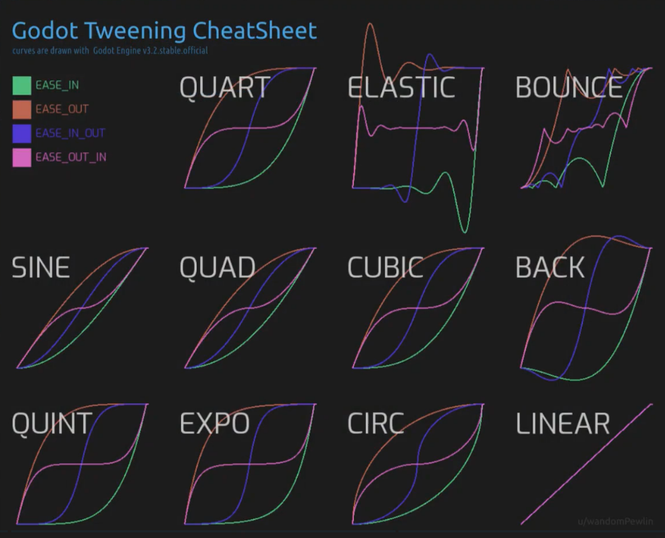

【写在前面】本文为初学 Godot 整理的笔记，内容质量无法保证，仅供参考

本总结主要涉及到的教程有：

- [【中字】Godot 3.2像素风ARPG制作教程（全集）\_哔哩哔哩\_bilibili](https://www.bilibili.com/video/BV15D4y1U7j5/)
- [合集·Godot 3.x 平台跳跃游戏教程](https://space.bilibili.com/7092/channel/collectiondetail?sid=44810)（暂时搁置，有机会再补充）
- [合集·《迷失岛2》游戏框架](https://space.bilibili.com/7092/channel/collectiondetail?sid=439500)
- [合集·《勇者传说》Godot 4教程](https://space.bilibili.com/7092/channel/collectiondetail?sid=1304862)（可以参考 [Godot 4 教程《勇者传说》编程笔记](https://kazelee.github.io/2023/11/02/godot-4-2d-adv-notes/)）

<!-- 【补充】其实《迷失岛2》的教程非常好，涉及到很多知识点；但当时学的时候囫囵吞枣，跟着做一遍就算了，没有仔细去分析背后的原理。后续应该会再重新复习一遍教程并给出笔记，当然，应该避免像 2DAdventure 的教程笔记一样事无巨细，代码更改的每一步都做记录；而是对项目结构和代码进行分析思考后，给出自己的心得体会。 -->

## 基本知识点

### 脚本/节点与场景

- 新建脚本会继承自某一个节点（如果声明了 `class_name`，则可以在节点树面板显示）
- 可以选择继承自脚本，相当于进一步继承（节点就是类，实例化节点就是类创建对象）

场景：由节点组成，作为游戏的加载单位

需要注意的是：

- 使用 `MyNode.new()` 后，创建的是实例化的节点，而不是实例化的场景！（也就是说，如果你创建了一个场景，有多个节点，新建根节点并不会实例化整个场景）
- 实例化场景，必须要用如下的代码才能实现：

```gdscript
const Scene = preload("res://scene.tscn")
# ":=" 只能用于类型可推测的情形，否则需要使用 ": Type = ..." 的形式
# 或者：var scene := Scene.instantiate() as Node
var scene = Scene.instantiate()
```

### 场景树与父子节点

场景树一定有一个根节点，向场景树插入节点可以视作是一种“用组合替代继承”的设计哲学。

一些函数的返回类型和返回值含义（初学极容易搞混）：

| 函数/属性                     | 返回类型    | 返回值含义                     |
| :---------------------------- | :---------- | :----------------------------- |
| Node.get_tree()               | SceneTree   | 当前场景（循环单位）           |
| Node.get_tree().current_scene | Node        | 当前场景（根节点）             |
| Node.get_tree().root          | Window      | 游戏运行的根目录               |
| PackedScene.instantiate()     | Node        | 实例化场景的根节点             |
| Node.add_child(Node)          | void        | -                              |
| Node.get_children()           | Array[Node] | 子节点列表（默认不含孙子节点） |
| Node.get_parent()             | Node        | 父节点（没有则返回null）       |

各类型的实际含义：

- SceneTree：由 MainLoop 派生而来，是游戏循环的单位
- Node：节点，开发者视角下的“场景”指代的就是根节点（根节点是“对象”，子节点是“属性”）
- Window：游戏窗口，游戏运行的根目录（通常通过 `get_tree().root` 访问）
- PackedScene：继承自 Resource 节点，通过 load/preload 函数加载场景文件返回

【个人理解】场景树是放在一个可以循环运行的“容器”里的，这个“容器”就是 SceneTree；开发者访问场景树，实际上是访问场景树的根节点，而不是这个“容器”（其实就是「场景树」和「节点树」的区别）

补充：`add_child` 函数只会在场景中临时生成节点，不会设置父节点为 owner；owner 表示新增的节点会作为场景文件的一部分（谨慎使用 owner！你很可能不希望游戏运行通过脚本临时新增的节点被持久化到场景文件中）

### 信号和组

Godot 中一般遵循这样的编程规范：向下调用，向上信号——即，在同一个节点树中，父节点访问子节点，可以调用子节点的函数；子节点访问父节点，就需要传递信号。

特别地，可以在脚本中使用 `@export` 引入需要的对象类型，然后将场景树中的节点（可以是父节点或父节点的其他子节点）拖进检查器中，实现不使用信号的调用。

一个对组的简要介绍：[Godot 4 | groups overview - YouTube](https://www.youtube.com/watch?v=Acoxb9VmyWc)

组主要用于对同一类或需要同样操作的对象，比如敌人检测到玩家等。将场景的根节点加入组，实例化后都归属于这个组中，可以通过 `get_tree().call_group("objects", "function")` 调用对应函数，或者通过 `get_tree().get_nodes_in_group("objects")` 获取成员列表。

（更详细的介绍可以参考官方文档和相关视频，这里不再赘述）

## 状态机（逻辑与动画的处理）

### ARPG 项目的做法

（注：该做法虽然基于 uheartbeast 的 ARPG 项目，但思想是从别人教程中借鉴的）

将逻辑与动画分离，逻辑部分通过 `_physics_process` 每帧轮询，动画部分通过 `_process` 每帧轮询。两个函数都监听玩家的输入，然后分别做逻辑和动画的处理。

代码形如：

```gdscript
# 一个全局状态变量，State是状态枚举类
var state := State.IDLE

# 处理动画/素材加载等
func _process(delta: float) -> void:
	update_animation_parameters()

# 处理角色状态/运动逻辑等
func _physics_process(delta: float) -> void:
	# 接受玩家输入
	input_vector = Input...
	...
	# 对各状态执行不同的操作
	match state:
		State.IDLE:
			# 可以为每个状态专门写一个函数处理
			...
		...

# 动画处理函数，在_process中调用
func update_animation_parameters() -> void:
	if ... # 状态/按下什么键……
		# 播放动画（这里是动画树设置状态转移bool值的例子）
		animation_tree["..."] = true
	...
```

这种做法是自己早期编程探索出来的，现在看来稍显幼稚，难以支撑大项目的开发。

### timothyqiu 的做法

编写一个可以复用的状态机脚本，项目中所有需要切换状态的对象都可以引用此节点，并实现所需的函数；所有的对象实现状态切换的模式都是一样的，也便于管理。

状态机脚本（这里直接复制 2D Adventure 的代码）：

```gdscript
class_name StateMachine
extends Node

const KEEP_CURRENT := -1

# 避免枚举默认为0，导致“从0变到0”
var current_state: int = -1:
	# 使用父节点的函数为变量赋值
	set(v):
		owner.transition_state(current_state, v)
		current_state = v
		state_time = 0

# 在状态机中实现Timer的效果
var state_time: float

func _ready() -> void:
	# 确保父节点ready，避免初始化后调用父节点函数而父节点unready
	await owner.ready
	current_state = 0

func _physics_process(delta: float) -> void:
	while true:
		var next := owner.get_next_state(current_state) as int
		if next == KEEP_CURRENT:
			break
		current_state = next

	# 使用方无需定义physics_process，只需定义此函数
	owner.tick_physics(current_state, delta)
	state_time += delta
```

需要实现的函数：

- get_next_state - 获取下一个状态（每帧都调用，状态相同返回 -1）
	- 内容：根据当前状态和操作，判断下一个状态是什么
	- 形如 `State.A: if ... : return State.B`
- transition_state - 状态改变时的操作（只在状态前后不同的时候才调用）
	- 内容：状态切换的瞬间应该做什么（包括动画播放和其他一些操作）
	- 形如 `if -> State.A: animation_player.player(...) do xxx`
- tick_physics - 调用状态机的对象，用来替代 `_physics_process` 的函数
	- 运动逻辑，形如 `match state: State.A: move(...)`

注意：最好不要把其他的逻辑塞进这三个函数中（比如，如果想要实现动画播放结束后执行一些操作，最好不要在 `get_next_state` 函数中实现，毕竟这个函数只用于返回下一状态，如果状态不变，就不应该有多余的操作；可以在动画轨道中调用，或者写一个回调函数）

### 节点状态机初探

高级状态机参考文章：[Building a more advanced state machine in Godot – The Shaggy Dev](https://shaggydev.com/2022/02/13/advanced-state-machines-godot/)

YouTube 教程：

- [Finite State Machines in Godot 4 in Under 10 Minutes - YouTube](https://www.youtube.com/watch?v=ow_Lum-Agbs)
- [State Machine Setup for 2D Platformer Character ~ Godot 4 GameDev Tutorial - YouTube](https://www.youtube.com/watch?v=fuGiJdMrCAk)

基础的 State 类包括如下的方法：

- Enter：进入此状态的操作
- Exit：离开此状态的操作
- Update：与画面和逻辑有关的操作（如动画、计时器）
- Physics Update：与运动物理有关的操作（如速度）

往往需要一个状态机/管理来控制状态的转换并记录当前状态，通常包含：

- states：字典或列表，用于记录各个状态（使用 get_children 方法获取）
- current_state：记录当前的状态，便于直接调用节点的方法

（这里不作深究，这种方法更适合 C# 大项目的规范）

## UI 设计（Panel/回合制/解谜）

### 节点补间动画

基本的逻辑如下：

```gdscript
var tween := create_tween()
# 默认是线性插值（Linear）
tween.set_ease([缓动效果]).set_trans([过渡效果])
# 将object对象的property属性（字符串名称），插值过渡到final_val，持续t秒
tween.tween_property(object, "property", final_val, t)
# 相当于动画的“等待时间”
tween.tween_interval(t)
# 动画结束后回调函数，参数为callable类型
tween.tween_callback(...)
```

其中，缓动和过渡效果的参数可以参考（颜色表示缓动，不同曲线组表示过渡）：



1. 移动动画举例

```gdscript
func _move_stone(stone: H2AStone, slot: int):
	stone.current_slot = slot
	# 为移动效果添加动画
	var tween := create_tween()
	tween.set_ease(Tween.EASE_IN).set_trans(Tween.TRANS_SINE)
	tween.tween_property(stone, "position", _get_slot_position(slot), 0.2)
	# 等待时刻后判断是否完成
	tween.tween_interval(1.0)
	tween.tween_callback(_check)
```

2. 旋转动画举例

```gdscript
func _on_reset_interact() -> void:
	# 齿轮转动的效果
	var tween := create_tween()
	tween.set_ease(Tween.EASE_IN_OUT).set_trans(Tween.TRANS_SINE)
	# as relative 相对旋转角度，因为初始可能是 0 或 360
	tween.tween_property(gear, "rotation", 360.0, 0.2).as_relative()
	tween.tween_callback(Callable(board, "reset"))
```

### 脚本生成多节点

以“在棋盘上生成棋子”的效果为例：

```gdscript
func _update_board():
	# 刷新需要删除之前生成的节点
	for node in get_children():
		if node.owner == null:
			node.queue_free()
	# 对每个棋子数据生成棋子对象
	for stone_id in stone_ids:
		var stone := Stone.new()
		add_child(stone)
		stone.id = stone_id
		# 设置stone的位置，依据一个函数（可以通过下标索引）
		# 如：从左向右依次生成，就可以返回
		# func(index: int): return Vector(index * width, stone.position.y)
		stone.position = ...
```

【注意】需要为生成的节点声明类名称（class_name）

### 场景转换效果

场景的转换有内置的 `change_scene_to_file` 函数，但这个函数是 deferred 的，第二帧才能看到效果，为此，可以自行编写函数处理：

```gdscript
@onready var color_rect: ColorRect = $ColorRect

func change_scene(path: String) -> void:
	# 场景“黑入”“黑出”的转场效果
	var tween := create_tween()
	tween.tween_callback(color_rect.show)
	tween.tween_property(color_rect, "color:a", 1.0, 0.2)
	tween.tween_callback(Callable(self, "_change_scene").bind(path))
	tween.tween_property(color_rect, "color:a", 0.0, 0.3)
	tween.tween_callback(color_rect.hide)

func _change_scene(path: String):
	var old_scene := get_tree().current_scene
	var new_scene := load(path).instantiate() as Node

	var root := get_tree().root
	root.remove_child(old_scene)
	root.add_child(new_scene)
	get_tree().current_scene = new_scene

	# 手动释放，因为父节点替换了不会自动删除
	old_scene.queue_free()
```

对每个场景，也可专门设计一个场景的进入效果：

```gdscript
var tween := create_tween()
	# 场景进入效果，在每一个场景开始时出现
	tween.set_ease(Tween.EASE_OUT).set_trans(Tween.TRANS_SINE)
	tween.tween_property(self, "scale", Vector2.ONE, 0.3).from(Vector2.ONE * 1.05)
```

### 物品获取处理

玩家点击物品 -> 播放物品获取动画（这期间不允许玩家再交互）-> 物品消失

参考代码如下：

```gdscript
# 新建一个图层来“掉包”（让玩家以为还是原来那个）
var sprite := Sprite2D.new()
sprite.texture = item.scene_texture
get_parent().add_child(sprite)
sprite.global_position = global_position

# 在新的spite上创建tween，此时不可点击交互
var tween := sprite.create_tween()
tween.set_ease(Tween.EASE_IN).set_trans(Tween.TRANS_BACK)
tween.tween_property(sprite, "scale", Vector2.ZERO, 0.15)
tween.tween_callback(sprite.queue_free)

queue_free()
```

【吐槽】锈湖系列经常会出现连续点击一个物品后位置偏移的 bug，很可能就是没有很好地处理这部分的逻辑，没有确保物品交互后播放动画期间不能被玩家交互。

## 多对象交互（动作）

### 攻击与无敌时间

攻击的本质，是攻击方的 Hitbox 与受击方的 Hurtbox 重叠，大致的流程是：

- 攻击方进入攻击状态，开启 Hitbox
- 如果攻击状态中，Hitbox 与 Hurtbox 重叠：
	- 受击方进行相应的操作，如扣血、添加受击效果等（可通过传递自定义信号，或使用 `area_entered` 信号传进的 area 的属性实现）
- 如果没有重叠，无事发生（miss）
- 攻击状态结束，关闭 Hitbox
- （注：自始至终，对象的 Hurtbox 都是默认开启的，除非进入无敌时间或游戏需要）

无敌时间，一般使用计时器来实现：受击时，开启无敌时间，设置 hurtbox 的可见性为 false；timeout 后，设置 hurtbox 的可见性为 true

补充：uheartbeast 的项目中，是直接在 area 的信号函数中扣血，而 timothyqiu 的项目是在 `transition_state` 中的 Hurt 状态下扣血（后者尽可能把状态转换的操作都放进函数 case 中）

需要注意的问题：

1. 通常 Hitbox 和 Hurtbox 关于重叠的处理，只在其中一个里面实现：如果在 Hitbox 中实现，Hurtbox 的可见性与 monitorable 挂钩；如果在 Hurtbox 中实现，Hurtbox 的可见性与 monitoring 挂钩（这也是 uheartbeast 的项目中的一个问题：搞混了两个参数）
2. 如果有受击动画，并且无敌时间在受击动画之间，可以考虑在受击动画的轨道上设置变量值

补充：击退效果（以 ARPG 项目为例）

```gdscript
const KNOCKBACK_SPEED := 120.0
# 注：玩家的 hitbox 定义了 knockback_vector
func _on_hurtbox_area_entered(area: Area2D) -> void:
	stats.health -= area.damage
	velocity = area.knockback_vector * KNOCKBACK_SPEED
	...
```

### 敌人追踪玩家

1. 使用 RayCast 实现：常用于横板动作游戏中地面人物的寻物 AI

RayCast 从敌人的眼睛发出，检测敌人前方的玩家（不包括后方，所以玩家可以背后偷袭）

```gdscript
@onready var player_checker: RayCast2D = $Graphics/PlayerChecker

func can_see_player() -> bool:
	if not player_checker.is_colliding():
		return false
	else:
		return player_checker.get_collider() is Player
```

2. 使用 Area2D 实现：常用于俯视角 2D 游戏，或横板动作游戏的飞行敌人寻物 AI

为敌人设置一个检测玩家的 Area，玩家进入敌人的 DetectionArea 时，敌人登记玩家；玩家离开后，变量恢复空值。敌人的脚本在需要追踪玩家时，调用函数判断是否检测到玩家：

```gdscript
extends Area2D

var player = null

func can_see_player():
	return player != null

func _on_body_entered(body: Node2D) -> void:
	player = body

func _on_body_exited(body: Node2D) -> void:
	player = null
```

### 敌人软碰撞

我们希望多个敌人同时追赶玩家时，不要互相重叠；但如果直接设置敌人间相互碰撞（即设置敌人的根节点的碰撞 mask 为自己所在的层 layer），又会显得生硬，所以需要软碰撞。

软碰撞的本质是，当敌人相互碰撞时（此时已经有重叠了，如果使用普通的碰撞就不会有重叠的可能），给敌人之间一个对彼此相反的“力”，即一个运动方向向量，然后处理赋值给 velocity，代码的实现大致如下：

```gdscript
# soft_collision.gd
extends Area2D

func is_colliding():
	# 有重叠区域（重叠区域的数量大于0）
	var areas = get_overlapping_areas()
	return areas.size() > 0

func get_push_vector():
	var areas = get_overlapping_areas()
	var push_vector = Vector2.ZERO
	if is_colliding():
		var area = areas[0]
		# 根据第一个重叠区域，运动方向由对方指向自己，给出方向向量
		push_vector = area.global_position.direction_to(global_position)
		push_vector = push_vector.normalized()
	return push_vector

# enemy.gd部分
if soft_collision.is_colliding():
	velocity += soft_collision.get_push_vector() * delta * 400
```

## 其他机制简要列举

2D 平台游戏（设计方面可以参考：[【游戏制作工具箱】《蔚蓝》的手感为何迷人？Why Does Celeste Feel So Good to Play? | GMTK\_哔哩哔哩\_bilibili](https://www.bilibili.com/video/BV1M441197sr/) 9'30" 处，与教程相呼应）

- 狼跳：设置郊狼时间，走出地面开启，倒计时内仍然可跳跃
- 跳跃预判：快要着陆时按下跳跃键也可以在落地后起跳（按下跳跃键后开始计时，在时间内着陆后自动起跳）
- 长短跳：松开跳跃键后，若向上速度仍然很大，立即减速（短跳）
- 滑墙/蹬墙跳等（注意落地接水平输入需要立刻切换状态）

2D 俯视角游戏（也含 2D 横板动作游戏）

- 敌人追踪 AI：结合前面“追踪玩家”的实现，如果发现玩家，进入追逐状态（向玩家方向行进）；如果玩家远离探测区域，恢复站立/游荡状态（可以配合寻路算法，避免敌人卡墙的情况）
- 敌人游荡状态：编写脚本专门实现，进入游荡状态后随机获取一个游荡时间，在此期间，朝着一个随机的方向移动随机距离（需要保证距离不能过小或过大）

```gdscript
@export var wander_range := 32.0

@onready var start_position = global_position
@onready var target_position = global_position

func update_target_position():
	var target_vector = Vector2(randf_range(-wander_range, wander_range), randf_range(-wander_range, wander_range))
	target_position = start_position + target_vector
```

其他常见游戏机制实现思路：

- 存档：通过全局脚本控制，关键性的操作要实时调用该脚本保存，关闭游戏后写入文件，开启游戏后读取文件（可以使用字典保存成 json 文件，不过很多开发者建议自定义格式；json 的文件格式过于麻烦，web 可能需要这种统一的文件格式，游戏开发就没必要刻意遵守了）
- 音乐/音效：通过全局脚本控制，在需要的时候调用播放音乐的函数即可
- 读档的场景变化：创建 FlagSwitch 脚本，可以结合存档的全局脚本使用；当场景需要变化时，先将变化传递给存档脚本，存档脚本再发出信号到 FlagSwitch 中，调用节点变化函数

参考：《迷失岛2》复刻项目

```gdscript
class_name FlagSwitch
extends Node2D

@export var flag: String

var default_node: Node2D # flag 不存在时显示
var switch_node: Node2D # flag 存在时显示

func _ready() -> void:
	var count := get_child_count()
	if count > 0:
		default_node = get_child(0)
	if count > 1:
		switch_node = get_child(1)

	Game.flags.connect("changed", _update_nodes)
	_update_nodes()

func _update_nodes():
	var exists := Game.flags.has(flag)
	if default_node:
		default_node.visible = not exists
	if switch_node:
		switch_node.visible = exists
```

（以上只是对参考教程中提到的要素做简要整理，远远达不到全面的程度）
