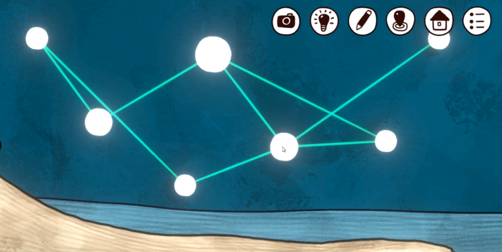
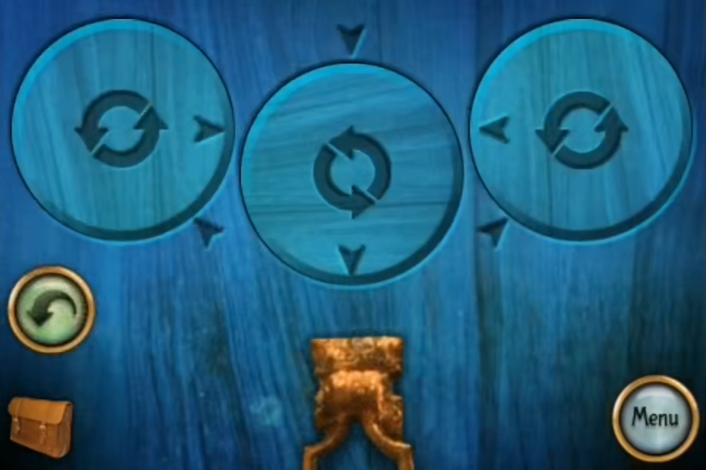
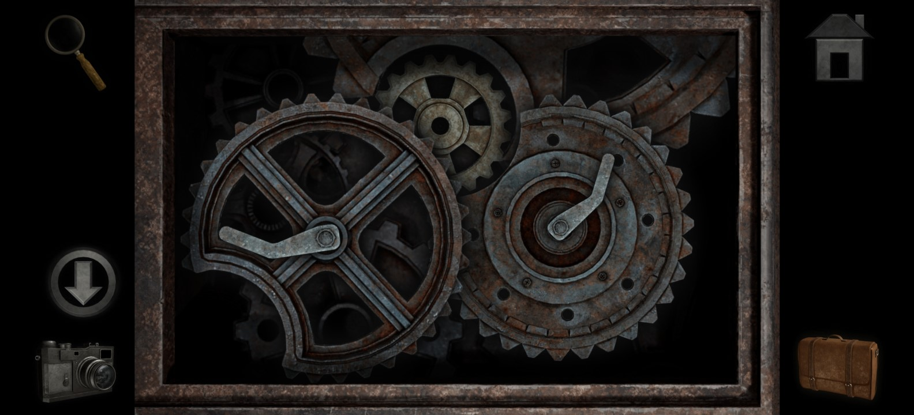

开关问题前篇：[开关问题算法与游戏中的例子](../../2023/1108-algorithm-switch-problem/)

【联动装置】这里指代所有「改变部分组件状态，会同时改变其他组件」的装置

具体地，对于装置 $A$，其内部有 $n$ 个组件（ $a_1, a_2, ... , a_n$），如果有

$$
\exists i,j \in [1,n], i,j \in \mathbb{Z}, i ≠ j, a_i \to a_j
$$

其中 $a_i \to a_j$ 表示改变 $a_i$ 也会改变 $a_j$，则称装置 $A$ 为「联动装置」

### 开关灯（补充）

开关灯问题是这其中最典型的一类问题，在前篇中已经做了相关阐述，这里仅补充一种思路：对于「点线网络」的开关灯谜题，往往会有那种「单分支」，比如《迷失岛：海边游乐园》中的：

鼠标所在的点右上角就是一个单分支，很容易想到，如果我们保证除这两个点外的所有点都已经被点亮，那么最后点击右上角的节点就解决了。

显然，与鼠标所在点相接的另外三个点中，必须有 0 个或 2 个点被点击（点击自己没有意义，不考虑），这就变成了一个“3 选 2”的问题，解法就呼之欲出了。

前篇列举的诸多案例中，《逃离方块：阿尔勒》中的“向日葵谜题”也是这样的，有一个明显的单分支，可以用同样的思路求解。当然，对于没有明显单分支的谜题，这种方法就不那么奏效了。

<!--除开关问题外，还有一些类似的问题，也属于联动装置问题，下面列举几种案例。此外，还有一些不属于联动装置的案例，也不可避免地在下文有所涉及。-->

### 转盘型

《恐怖庄园的秘密》结尾有一个这样的转盘解谜：

我们要将轮盘上的指针与外框对齐，目前可以认为图像是左右对称的，中间差了半圈，左右两轮则差了不知道多少度（虽然目测大概是 1/8 圆，但这种情况很容易判断失误，尽量不要考虑模棱两可的条件）。三个轮子大小相同，最右面的轮子可以控制中间，中间的可以控制左边，左边的可以同时控制另外两个；其中相邻两个转盘的旋转方向相反（想象摩擦力足够大的情况）。

对于这种难以量化的解谜，就最好确保每一步都是“有确定值”的（每次移动都是把转盘转到目标位置，如果不依赖这个“尺子”，后续调整就容易“抓瞎”了），尽管理论上可以直接“微调”求解。

我们还是从数学层面给出暴力破解的策略。不妨设从左到右的轮子依次为 $A, B, C$， $A$ 轮和 $C$ 轮的偏差弧度绝对值为 $\alpha$ 。以网框的箭头为准，逆时针为正，三个轮子需要转动的角度分别为 $a, b, c$。其中 $A$ 轮影响 $B$ 轮和 $C$ 轮； $B$ 轮影响 $A$ 轮； $C$ 轮影响 $B$ 轮。

梳理列表如下（其中竖向是轮被影响的情况，横向是影响别的轮的情况）：

| 轮序号 | $A$ | $B$ | $C$ |
| -- | :--: | :--: | :--: |
| 差值 | $-\alpha$ | $\pi$ | $-\alpha$ |
| $A$ | $a$ | $-a$ | $a$ |
| $B$ | $-b$ | $b$ | |
| $C$ | | $-c$ | $c$ |

则可以列式：

$$
\begin{array}{l}
  a-b=-\alpha + 2k\pi \\
  -a+b-c=\pi + 2k\pi \\
  a+c=\alpha + 2k\pi
\end{array}
$$

其中， $k$ 仅表示循环，并不是具体的值，类似于 $\pmod{2\pi}$ 。由此易得：

$$
\begin{array}{l}
  a=\pi + 2k\pi  \\
  b=\alpha + \pi + 2k\pi \\
  c=\alpha - \pi+ 2k\pi
\end{array}
$$

后面的操作就更接近倒水问题了，用有限的操作凑偏差值，这里不再赘述。解法可以参考：[【解谜游戏】火枫解谜游戏合集（更新至眼镜蛇的诅咒）—恐怖庄园的秘密+失落之城+重返神秘庄园+渥太华的秘密+密林溪流(攻略向)](https://www.bilibili.com/video/BV1sJ411e7Kx/?t=572)

更复杂一点的，如《子午线157：第三章》中有一个齿轮解谜：

不妨设左下方的齿轮为 $A$ 轮，右下方的齿轮为 $B$ 轮，上面露出一部分的齿轮是 $C$ 轮（注：中间那个小齿轮是谜题解出后会获得的，可以无视）；其中， $A$ 轮每旋转 3 圈， $C$ 轮旋转 1 圈； $B$ 轮每旋转 4 圈， $C$ 轮旋转 1 圈； $A$ 轮和 $C$ 轮的旋转方向相同， $B$ 轮与 $C$ 轮旋转方向相反， $C$ 轮自己无法转动。最终，我们需要三个齿轮的缺口都移动到中间形成一个环，方便拿出中间的齿轮。

我们这里优先移动 $B$ 轮使其归位，然后转动 $B$ 轮使 $C$ 轮归位，情况如图所示： $B$ 轮和 $C$ 轮都已经归位， $A$ 轮差半圈。仿照刚刚的谜题做法，先梳理出下面的表格：

| 轮序号 | $A$ | $B$ | $C$ |
| -- | :--: | :--: | :--: |
| 差值 | $\pi$ | $0$ | $0$ |
| $A$ | $a$ | | $-\frac{1}{3}a$ |
| $B$ | | $b$ | $\frac{1}{4}b$ |
| $C$ | | | |

列式如下：

$$
\begin{array}{l}
  a=\pi +2k\pi \\  
  b=2k\pi \\
  -\frac{1}{3}a+\frac{1}{4}b=2k\pi
\end{array}
$$

与刚才谜题不同的是，这里用三个方程对两个参数进行了限制，所以重复旋转的圈数多少也不是随意的， $a$ 和 $b$ 之间有间接的牵制关系。

重设旋转圈数为 $n_a$ 和 $n_b$，以 1 圈为单位 1，原式转换如下：

$$
\begin{array}{l}
  a=\frac{1}{2} +n_a \\  
  b=n_b \\
  -\frac{1}{3}a+\frac{1}{4}b=k
\end{array}
$$

其中 $k$ 表示整数。代入，则有：

$$
-\frac{1}{6}-\frac{1}{3}n_a+\frac{1}{4}n_b=k
$$

整理，得：

$$
-4n_a+3n_b=2+12k=2 \pmod {12}
$$

这里不讨论数学意义上的通项解，易得 $n_a = -2, n_b = 2$ 是方程是一组解。即，顺时针转动 $A$ 轮两圈半，逆时针转动 $B$ 轮两圈，即可解决问题。

当然，实际的解谜是可以“微调”的，这其中的思路就很难用言语来解释了，参考下面两个实况：
- [【然叔】《子午线157：第三章》流程攻略解说～神秘陨石，旅程尽头！？](https://www.bilibili.com/video/BV1Lq4y1Q7Be/?t=579)
- [【子午线157：第三章 | 通关流程】最终章](https://www.bilibili.com/video/BV1Jq4y1p7pL/?t=378)

（暂时搁置对这个话题的继续探讨）

<!--
### 结语

使用数学工具解决这类解谜小游戏，本身就是剑走偏锋，违背了设计者的最初意图。而且，这终究是小圈子的狂欢罢了，参考[如何用线性代数知识解决纸嫁衣关卡？_哔哩哔哩bilibili](https://www.bilibili.com/video/BV1dj411978u/)这个视频，后面流量逐渐走低，up主也不再出续集了。

我自己的数学积累也有限。对于这类小游戏，其实使用一些数论/群论/图论/范畴论等知识或许处理得更好，比如魔方问题等。但我实在是没有精力再去研究这些了，也没有意义，投入产出比太低。

其实，比借助数学手段，更有价值的还是培养一种「游戏直觉」，就像对于上面的齿轮问题，有游戏经验的人可能真的几下就微调出来了。这种直觉就像深度学习的算法模型一样，难以解释是怎么做到的，很多时候就是玄学。我其实最开始就是想去描述这种数学直觉，但难度远超自己的能力。

对这些领域的研究也耗费了我很多的精力，我为之花费的时间累计起来，少说也有半个月。我实在是不能再浪费时间于这些无关痛痒的方向上了。所以姑且放弃研究和编辑，也收敛对这类点击解谜的热情吧。

我也的确更认同一部分硬核解谜开发者的思想，理解他们鄙视点击解谜的内在逻辑。点击解谜的很多小游戏，就像一些猜谜/高复杂度的关卡解谜一样，完全不考虑玩家如何解题（甚至可以和羊那个羊这种业界毒瘤相提并论，除了确保关卡有解外，二者也没有什么本质区别）

我也相信，优秀的解谜游戏，不会让玩家陷入猜谜/穷举的困境，也一定会在玩家解出谜题后有一种“啊哈”的豁然开朗的感觉。显然，很多点击解谜小游戏不会带给人这种感觉，只会在解完后长叹“终于结束了”，甚至还会回头质疑“怎么就过了”。复杂度过高，而又难以转化成更简单的模型的谜题，大抵如此。

补充：优秀案例如 baba is you，中立案例如 parabox，较差案例如 railbound（包括很多类见证者游戏，在我看来依旧不算是什么优秀的案例，猜谜试错的过程很痛苦，一点也不优雅，解出后也不会感到愉悦）
-->
